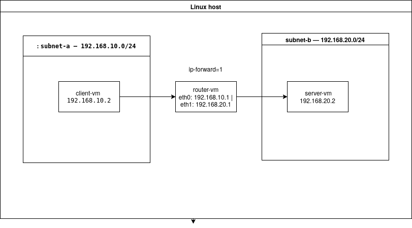
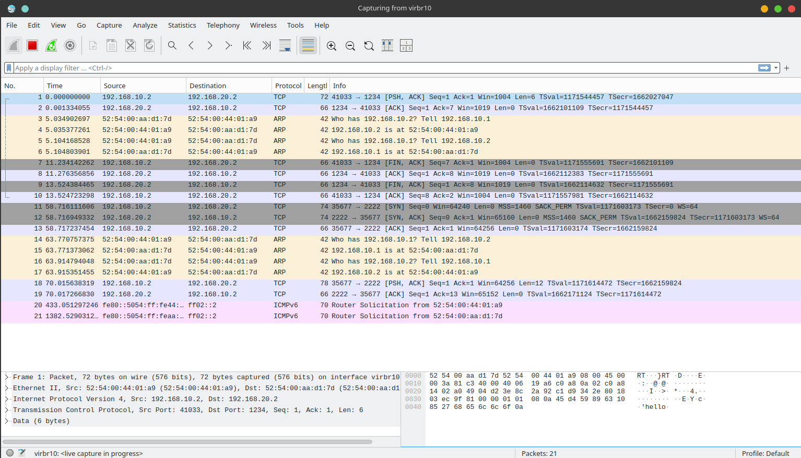

# Linux Virtual Datacenter Lab

Engineering a software-defined network with KVM/libvirt, a custom Linux kernel router, and live packet capture analysis using tcpdump and Wireshark — built entirely from the command line.

---

## Stack

`KVM` `QEMU` `libvirt` `virsh` `Alpine Linux` `virt-install` `tcpdump` `Wireshark` `Netcat` `Linux Networking` `CachyOS (Arch)`

---

## Network Architecture



| Machine   | Interface | IP Address        | Subnet   |
|-----------|-----------|-------------------|----------|
| router-vm | eth0      | 192.168.10.1/24   | subnet-a |
| router-vm | eth1      | 192.168.20.1/24   | subnet-b |
| client-vm | eth0      | 192.168.10.2/24   | subnet-a |
| server-vm | eth0      | 192.168.20.2/24   | subnet-b |

The router VM is dual-homed — it has one network interface in each subnet, which is what enables it to forward packets between them at Layer 3.

---

## Objectives

- Provision two isolated virtual subnets using libvirt XML network definitions
- Deploy three headless Alpine Linux VMs entirely from the CLI using virt-install
- Engineer a dual-homed Linux VM into a functional Layer 3 router
- Enable kernel IP forwarding via /proc/sys/net/ipv4/ip_forward
- Assign static IPs and default routes manually on each VM
- Verify end-to-end cross-subnet connectivity with ping
- Generate real TCP traffic between subnets using Netcat
- Capture and analyze live packets with tcpdump and Wireshark

---

## Deployment

<details>
<summary>Phase 1 — Hypervisor Setup</summary>

### Install core virtualization packages
```bash
sudo pacman -S qemu-full libvirt virt-install \
  dnsmasq bridge-utils openbsd-netcat tcpdump wireshark-qt
```

### Enable the libvirt daemon
```bash
sudo systemctl enable --now libvirtd
```

### Add user to required groups

Running everything as sudo is bad practice and will fail LFCS exam objectives. Add your user to the libvirt and wireshark groups instead:
```bash
sudo usermod -aG libvirt $USER
sudo usermod -aG wireshark $USER
```

</details>

---

<details>
<summary>Phase 2 — Virtual Network Fabric</summary>

Virtual networks in libvirt are defined as XML files. Two isolated subnets are created — one for the client side, one for the server side. DHCP is intentionally disabled to enforce static IP assignment.

### subnet-a.xml
```xml
<network>
  <name>subnet-a</name>
  <bridge name="virbr10" stp="on" delay="0"/>
  <domain name="subnet-a.local"/>
  <ip address="192.168.10.254" netmask="255.255.255.0">
  </ip>
</network>
```

### subnet-b.xml
```xml
<network>
  <name>subnet-b</name>
  <bridge name="virbr20" stp="on" delay="0"/>
  <domain name="subnet-b.local"/>
  <ip address="192.168.20.254" netmask="255.255.255.0">
  </ip>
</network>
```

### Inject into the hypervisor
```bash
sudo virsh net-define subnet-a.xml
sudo virsh net-define subnet-b.xml
sudo virsh net-start subnet-a
sudo virsh net-start subnet-b
sudo virsh net-autostart subnet-a
sudo virsh net-autostart subnet-b
```

### Verify
```bash
sudo virsh net-list --all
```

Expected output:
```
 Name       State    Autostart   Persistent
--------------------------------------------
 subnet-a   active   yes         yes
 subnet-b   active   yes         yes
```

</details>

---

<details>
<summary>Phase 3 — VM Deployment</summary>

All three VMs run headless Alpine Linux. ISOs are stored in /var/lib/libvirt/iso/ because the libvirt-qemu user does not have read access to home directories.
```bash
sudo mkdir -p /var/lib/libvirt/iso
sudo cp alpine-extended-3.19.1-x86_64.iso /var/lib/libvirt/iso/
```

### Router VM — dual-homed, one NIC per subnet
```bash
sudo virt-install \
  --name router-vm \
  --ram 512 \
  --vcpus 1 \
  --disk size=2 \
  --network network=subnet-a \
  --network network=subnet-b \
  --cdrom /var/lib/libvirt/iso/alpine-extended-3.19.1-x86_64.iso \
  --os-variant alpinelinux3.18 \
  --noautoconsole
```

### Client VM — subnet-a only
```bash
sudo virt-install \
  --name client-vm \
  --ram 512 \
  --vcpus 1 \
  --disk size=2 \
  --network network=subnet-a \
  --cdrom /var/lib/libvirt/iso/alpine-extended-3.19.1-x86_64.iso \
  --os-variant alpinelinux3.18 \
  --noautoconsole
```

### Server VM — subnet-b only
```bash
sudo virt-install \
  --name server-vm \
  --ram 512 \
  --vcpus 1 \
  --disk size=2 \
  --network network=subnet-b \
  --cdrom /var/lib/libvirt/iso/alpine-extended-3.19.1-x86_64.iso \
  --os-variant alpinelinux3.18 \
  --noautoconsole
```

### Verify all three are running
```bash
sudo virsh list --all
```

</details>

---

<details>
<summary>Phase 4 — Network Configuration</summary>

### Router VM

The router requires static IPs on both interfaces and kernel IP forwarding enabled:
```bash
ip addr add 192.168.10.1/24 dev eth0
ip addr add 192.168.20.1/24 dev eth1
ip link set eth0 up
ip link set eth1 up
echo 1 > /proc/sys/net/ipv4/ip_forward
```

Make IP forwarding permanent:
```bash
echo "net.ipv4.ip_forward = 1" >> /etc/sysctl.conf
```

Persist network config:
```bash
cat > /etc/network/interfaces << EOF
auto lo
iface lo inet loopback

auto eth0
iface eth0 inet static
    address 192.168.10.1
    netmask 255.255.255.0

auto eth1
iface eth1 inet static
    address 192.168.20.1
    netmask 255.255.255.0
EOF
```

### Client VM
```bash
ip addr add 192.168.10.2/24 dev eth0
ip link set eth0 up
ip route add default via 192.168.10.1
```

### Server VM
```bash
ip addr add 192.168.20.2/24 dev eth0
ip link set eth0 up
ip route add default via 192.168.20.1
```

</details>

---

## Verification

### Ping test — cross-subnet routing

From client-vm:
```bash
ping 192.168.20.2
```

Expected result:
```
64 bytes from 192.168.20.2: seq=0 ttl=63 time=0.476 ms
64 bytes from 192.168.20.2: seq=1 ttl=63 time=0.468 ms
```

TTL=63 confirms the packet was decremented exactly once, proving it passed through the router. A direct connection would show TTL=64.

---

### Netcat test — live TCP traffic

On server-vm:
```bash
nc -lp 1234
```

On client-vm:
```bash
nc 192.168.20.2 1234
```

Type any message and press Enter. The message appears on the server terminal, confirming end-to-end TCP connectivity across both subnets through the router.

---

## Packet Capture Analysis

Live TCP traffic was captured on virbr10 using Wireshark while Netcat transmitted data from client-vm to server-vm through the router.



### Capture command
```bash
sudo wireshark -i virbr10 -k
```

### Observed behavior

**ARP Resolution** — Before any TCP traffic flows, the client broadcasts an ARP request to resolve the router MAC address. The router responds, enabling Layer 2 framing across the virtual bridge.

**TCP Three-Way Handshake** — SYN, SYN-ACK, ACK sequence visible between 192.168.10.2 and 192.168.20.2, proving the router successfully forwarded the connection initiation across subnets.

**Data Transfer** — PSH/ACK packet visible carrying the Netcat payload. Message content visible in plaintext in the Wireshark packet inspector, confirming end-to-end delivery.

**TTL=63** — Confirms traffic passed through exactly one router hop, decremented from the Alpine default of 64.

---

## Troubleshooting

### Failed to create bridge interface — Operation not permitted

**Cause:** libvirtd daemon not running or user session not refreshed after group changes.

**Fix:**
```bash
sudo systemctl restart libvirtd
sudo usermod -aG libvirt $USER
newgrp libvirt
```

---

### Network not found — no network with matching name

**Cause:** virsh net-define was run without sudo, registering the network in the user session (qemu:///session) instead of the system session (qemu:///system). The two sessions are completely isolated.

**Fix:** Always use sudo consistently with all virsh and virt-install commands throughout the lab.

---

### Permission denied reading ISO file

**Cause:** QEMU drops privileges and runs as libvirt-qemu user, which has no read access to files inside /home/.

**Fix:** Always store ISOs in /var/lib/libvirt/iso/ which is owned by the libvirt-qemu user.
```bash
sudo mkdir -p /var/lib/libvirt/iso
sudo cp your.iso /var/lib/libvirt/iso/
```

---

### Boot failed — not a bootable disk

**Cause:** The alpine-virt ISO does not include syslinux locally. Without mirror access during installation the bootloader cannot be installed, leaving a non-bootable disk.

**Fix:** Use the alpine-extended ISO instead. It includes all packages locally and completes installation fully offline.

---

## Context

This lab was built as hands-on preparation for the CCNA and LFCS certifications, translating theoretical knowledge of network routing, Linux kernel networking, and packet analysis into a fully operational virtual datacenter built entirely from the command line on CachyOS Linux.
